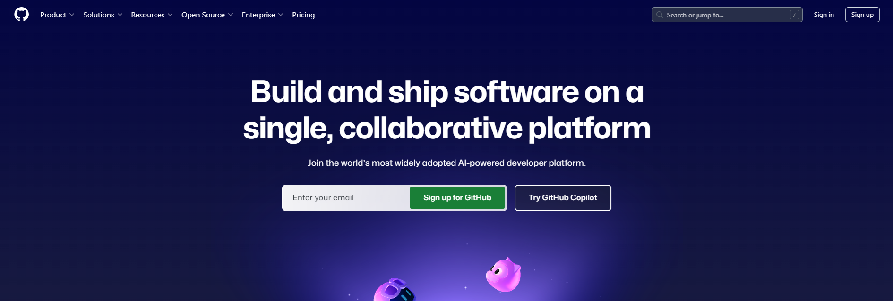
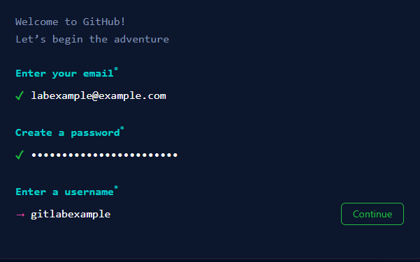
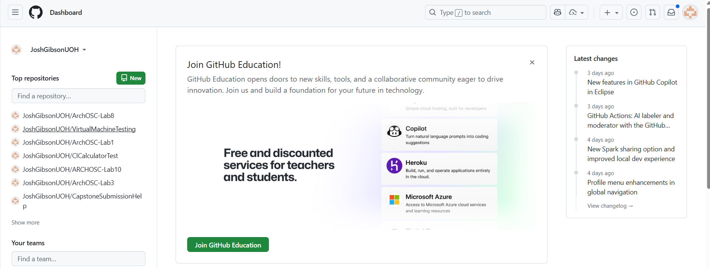

<html lang="en">
<head>
    <meta charset="UTF-8">
    <meta name="viewport" content="width=device-width, initial-scale=1.0">
    <!-- Bootstrap CSS -->
    <link href="https://stackpath.bootstrapcdn.com/bootstrap/4.5.2/css/bootstrap.min.css" rel="stylesheet">
</head>
<body>

    

    <svg xmlns="http://www.w3.org/2000/svg" width="16" height="16" fill="currentColor" class="bi bi-lightbulb" viewBox="0 0 16 16">
    <path d="M2 6a6 6 0 1 1 10.174 4.31c-.203.196-.359.4-.453.619l-.762 1.769A.5.5 0 0 1 10.5 13a.5.5 0 0 1 0 1 .5.5 0 0 1 0 1l-.224.447a1 1 0 0 1-.894.553H6.618a1 1 0 0 1-.894-.553L5.5 15a.5.5 0 0 1 0-1 .5.5 0 0 1 0-1 .5.5 0 0 1-.46-.302l-.761-1.77a2 2 0 0 0-.453-.618A5.98 5.98 0 0 1 2 6m6-5a5 5 0 0 0-3.479 8.592c.263.254.514.564.676.941L5.83 12h4.342l.632-1.467c.162-.377.413-.687.676-.941A5 5 0 0 0 8 1"/>
</svg> <strong>Note!</strong>

You may already have a GitHub account, if you do (and you don't want to keep your personal projects seperate from your University ones) you can scroll down to the "submit your GitHub" section

    

<!-- Bootstrap JS and dependencies -->

</body>
</html>

# Welcome Week - Creating a GitHub account

## What is GitHub?
GitHub is a cloud based content hosting service that allows people to store, manage, share and collaborate on software that they create. It has been owned by Microsoft since 2018 and is one of the largest hosts of source code on the planet.

## Getting a GitHub Account
Before you can start creating and using GitHub, you first need to create a GitHub account.

To do this, go to www.github.com in any web browser.

Click on "Sign Up"

Complete the step-by-step sign up process provided by GitHub.

<html lang="en">
<head>
    <meta charset="UTF-8">
    <meta name="viewport" content="width=device-width, initial-scale=1.0">
    <!-- Bootstrap CSS -->
    <link href="https://stackpath.bootstrapcdn.com/bootstrap/4.5.2/css/bootstrap.min.css" rel="stylesheet">
</head>
<body>

    

    <svg xmlns="http://www.w3.org/2000/svg" width="16" height="16" fill="currentColor" class="bi bi-lightbulb" viewBox="0 0 16 16">
    <path d="M2 6a6 6 0 1 1 10.174 4.31c-.203.196-.359.4-.453.619l-.762 1.769A.5.5 0 0 1 10.5 13a.5.5 0 0 1 0 1 .5.5 0 0 1 0 1l-.224.447a1 1 0 0 1-.894.553H6.618a1 1 0 0 1-.894-.553L5.5 15a.5.5 0 0 1 0-1 .5.5 0 0 1 0-1 .5.5 0 0 1-.46-.302l-.761-1.77a2 2 0 0 0-.453-.618A5.98 5.98 0 0 1 2 6m6-5a5 5 0 0 0-3.479 8.592c.263.254.514.564.676.941L5.83 12h4.342l.632-1.467c.162-.377.413-.687.676-.941A5 5 0 0 0 8 1"/>
</svg> <strong>Note!</strong>

If this is your first GitHub account, it is suggested you sign up using your new <strong><u>university e-mail.</u></strong> This will make it much easier to troubleshoot if you run into issues in the future, such as forgetting your password or losing access to two factor authentication. You will also be using your GitHub account for some of your assignments throughout your time with us - so you may want to keep your personal and university accounts seperate.

    

<!-- Bootstrap JS and dependencies -->

</body>
</html>

GitHub will send a "Launch Code" to the e-mail address that you just signed up with - you should log into your e-mail, locate the code and then use this to activate your account.

If you have done this succesfully you will then be redirected to the main GitHub page that should look similar to the one below. 

If you see this then congratulations you now have a functioning GitHub account!

## Submitting your GitHub Account

Now you have your bright and shiny new GitHub account (or if you have had one for a while!) you need to let us know what it is using the form below!

[GitHub Name Submission](https://forms.office.com/e/vy5JrPwZnQ)

Providing us with your GitHub name allows us to give you assignments using GitHub Classroom, and also helps to ensure that any work you complete is not lost. It also allows us to give you access to repositories that have advanced features that you will need throughout your degree!